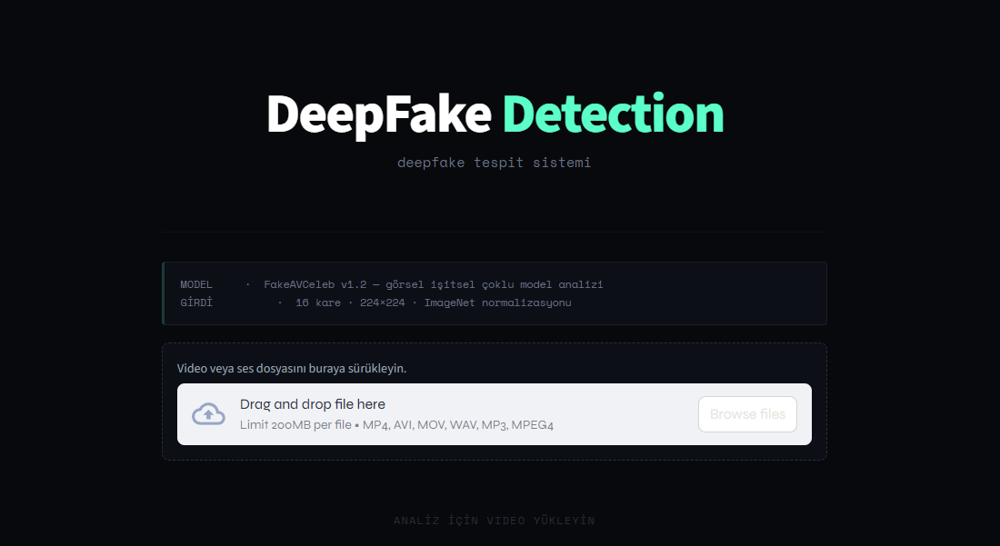
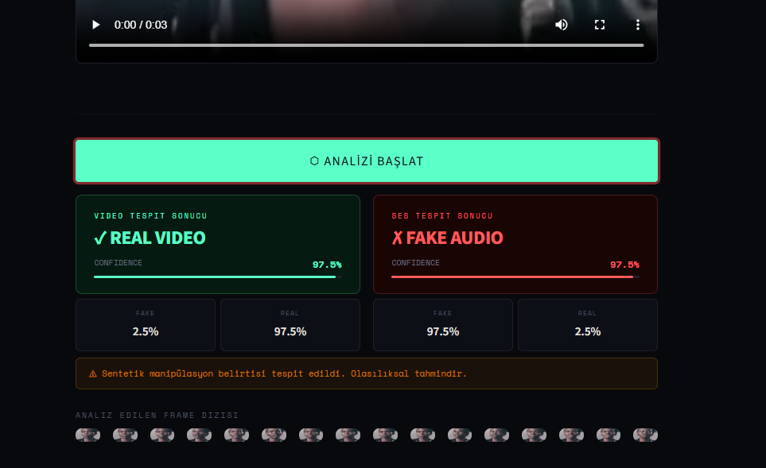

# Multimodal Deepfake Detection System

Bu proje, görüntü ve ses verilerini analiz ederek deepfake içerikleri tespit etmek için geliştirilmiş bir **Multimodal Deepfake Detection** sistemidir. Proje, görsel (CNN tabanlı) ve işitsel (audio forensic) verileri birleştirerek yüksek doğruluklu sonuçlar elde etmeyi hedefler.

## 🛠️ Kullanılan Teknolojiler
Bu sistem şu kütüphaneler ve framework'ler üzerine inşa edilmiştir:
- **Streamlit**: Web arayüzü ve dashboard yönetimi.
- **PyTorch & Torchvision**: Derin öğrenme modelleri (EfficientNet-B4).
- **OpenCV & MoviePy**: Video işleme ve kare çıkarımı.
- **Librosa**: Ses sinyali analizi ve frekans tabanlı özellik çıkarımı.
- **Einops**: Tensor manipülasyonu.

## 🚀 Kurulum

Projeyi kendi bilgisayarınızda çalıştırmak için aşağıdaki adımları izleyin:

1. **Repoyu Klonlayın:**
    git clone https://github.com/Zuuhal/DeepFake-Detection---Web-UI-
   
3. **Sanal Ortam Oluşturun (Önerilir):**
    python -m venv venv
   **Windows:**
   .\venv\Scripts\activate
   **Linux/macOS:**
   source venv/bin/activate

4. **Gerekli Kütüphaneleri Kurun:**
   pip install -r requirements.txt

5. **Uygulamayı Başlatın:**
   streamlit run main.py

